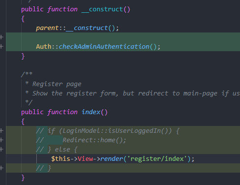
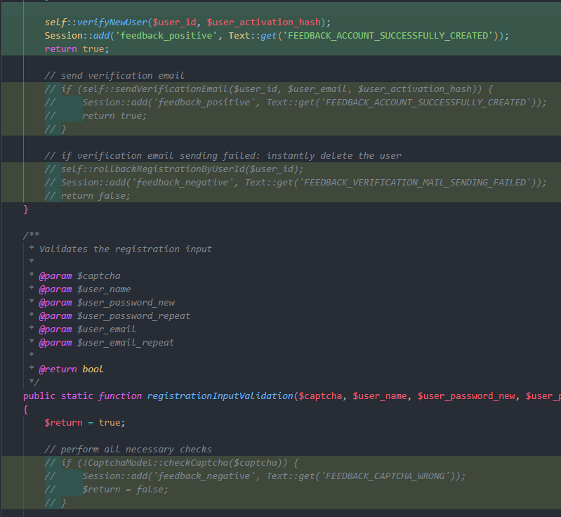
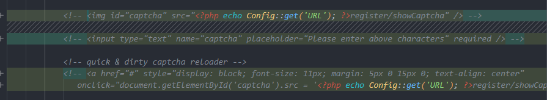
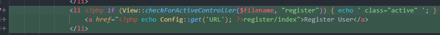

# HUGE Framework Aufgabe #002

## Aufagbe
Anpassung der Registrierung ohne Captcha 
Es soll eine Registrierung ohne Captcha und E-Mail-Verifikation ermöglicht werden. Dazu soll entweder das Captcha Feature deaktiviert oder entfernt werden. Benutzer sollen nach Registrierung automatisch aktiviert werden (auch ohne E-Mail-Verifikation)

Administratoren User anlegen
Nur Administratoren sollen mit demselben Formular User anlegen können.

## Veränderungen
#### Register-Controller (admin check + anzeige trotz zurzeitigem login)

#### Registration-Model (captcha check + remove verification email sending)

#### index.php (captcha frontend weg)

#### header.php (button für reg)
