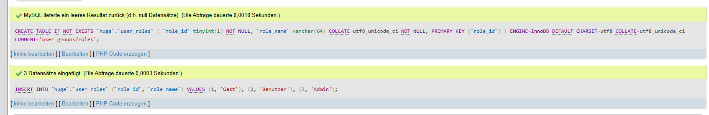
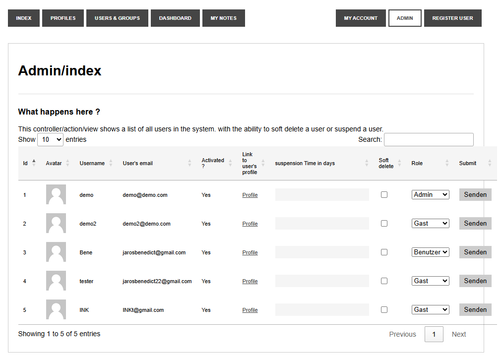
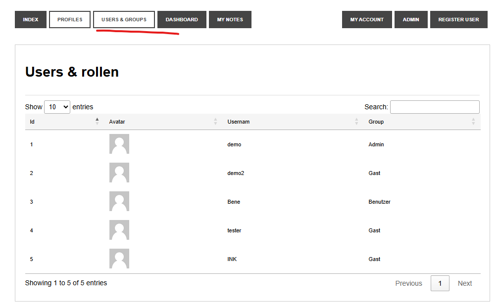

# HUGE Framework Aufgabe #003

## Aufagbe
1.	Verwaltungsmöglichkeit für Benutzer implementieren.
In der Standardvariante gibt es nur Benutzergruppen aufgrund des Types (eigenes Datenbankfeld).
Zu diesem Feld ist eine weitere Tabelle anzulegen, welche die Gruppe definiert und der Gruppe somit einen Namen gibt. (Admin = 7, Gast = 1, normaler User = 2, 3 – 6 sind offen für zukünftige Gruppen)
In der Useransicht des Admins soll jetzt diese Gruppe ausgewählt werden.
Ausserdem soll eine neue Ansicht mit allen Benutzern/Gruppen existieren – diese soll jeder angezeigt bekommen (kann von der Admin Ansicht abgeleitet werden), jedoch dürfen diese in dieser Ansicht nichts machen (nur Ansicht einer Liste).

2.	Die Liste soll als DataTable/jQuery implementiert werden.

## Datenbank

Zuerst wurde die Datenbank um die nueen Rollen erweitert.

## Code-Änderungen
#### UserModel.php
holt auch user_account_type und role_name aus der DB

#### UserRoleModel.php
Liest alle Rollen aus der DB damit sie im Dropdown da sind.

#### AdminModel.php
setUserRole(id, rid): setzt die Rolle eines Users in der DB

#### texts.php
selbsterklärend, neue texte

#### AdminController.php
gibt die Rollen an die View/Index weiter.

#### index.php
Jquery + role in tabelle

#### userlist.php, neu
öffentliche Ansicht für alle Benutzer, ohne login pflicht.

#### ProfileController.php
userList(): rendert die neue Methode

#### header.php
nav-menu eintrag für die liste.

## Screenshots
#### Admin Bereich

#### Public-List

