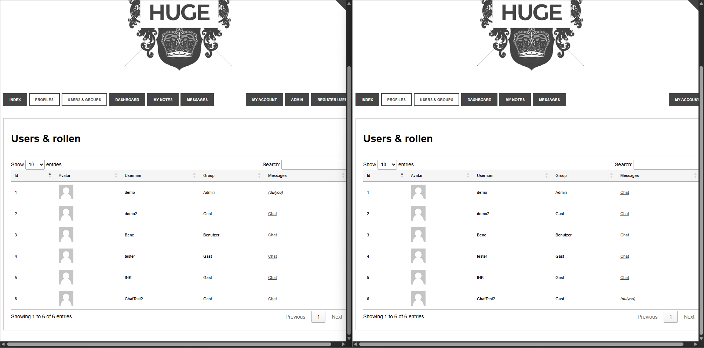
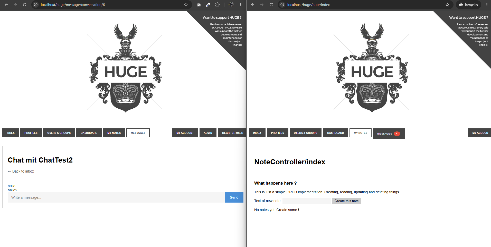
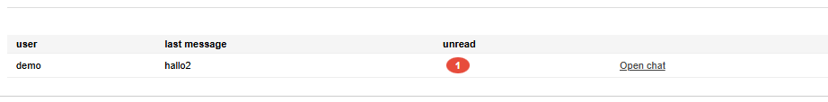
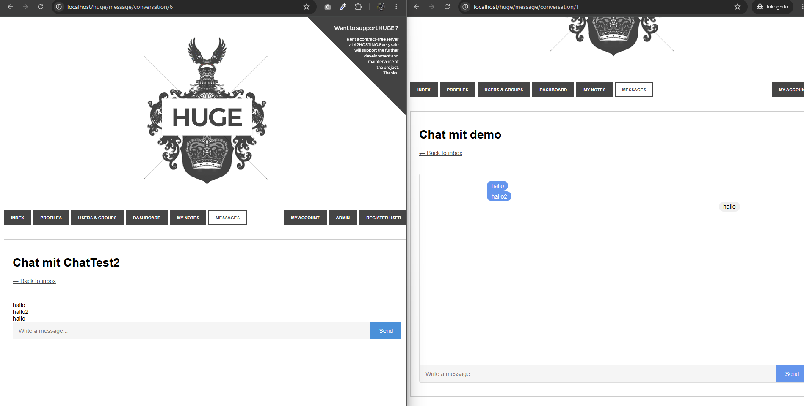
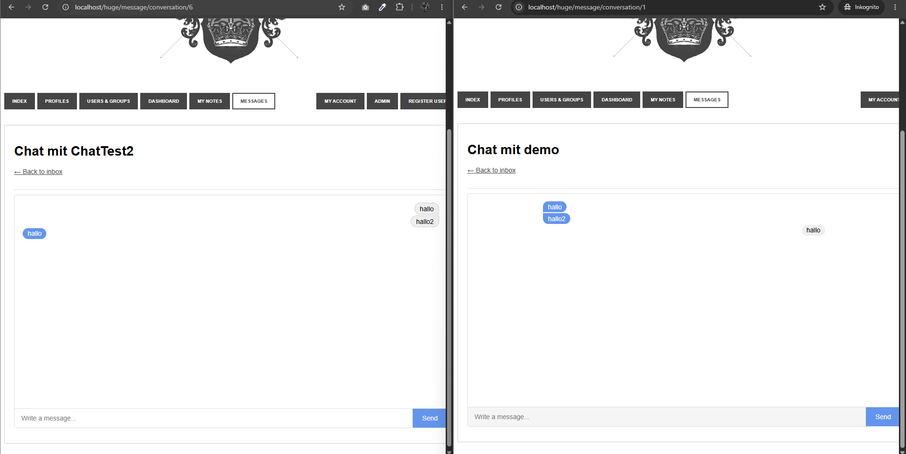

# HUGE Framework Aufgabe #004

## Aufagbe
1. Messenger-Dienst (ohne KI)
Integriere einen einfachen Messenger-Dienst (nicht live) – vollständig ohne KI-Unterstützung.
•	ER-Diagramm und DB-Tabelle(n) für Nachrichten zwischen Benutzern erstellen.
•	1:1-Nachricht an einen Benutzer senden (Eingabe via URL zum Testen).
•	Eigener Menüpunkt (oder Lösung über „Profiles“, eigener User ausgeblendet) mit Badge (Anzahl ungelesener Nachrichten, roter Kreis).
•	Messenger-Fenster (Partner links, eigene Nachrichten rechts). CSS-Vorlage: https://codepen.io/jmpp/pen/mprGZo

## Screenshots

## Bug fix wegen fehlendem CSS
War nicht CSS, sondern mein Browser hatte die alte CSS static gespeichert
