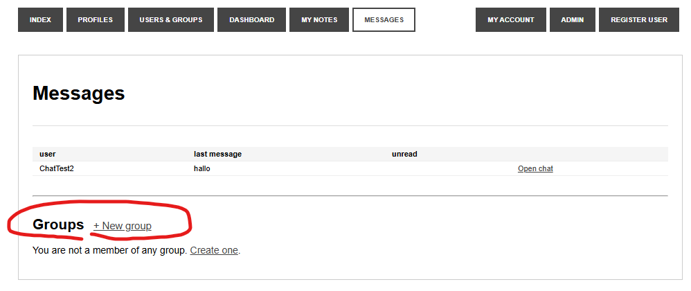
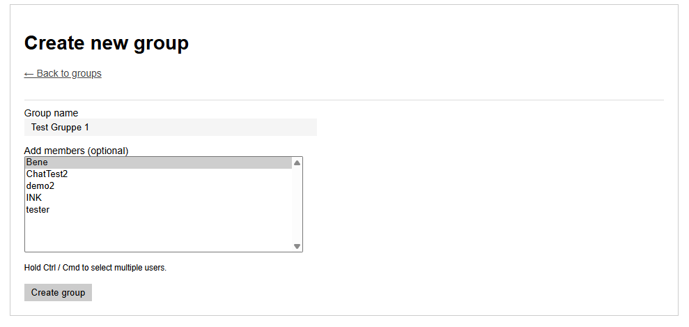
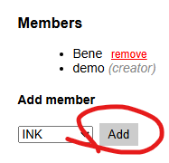
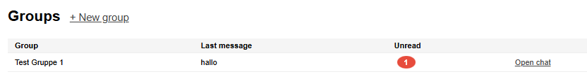
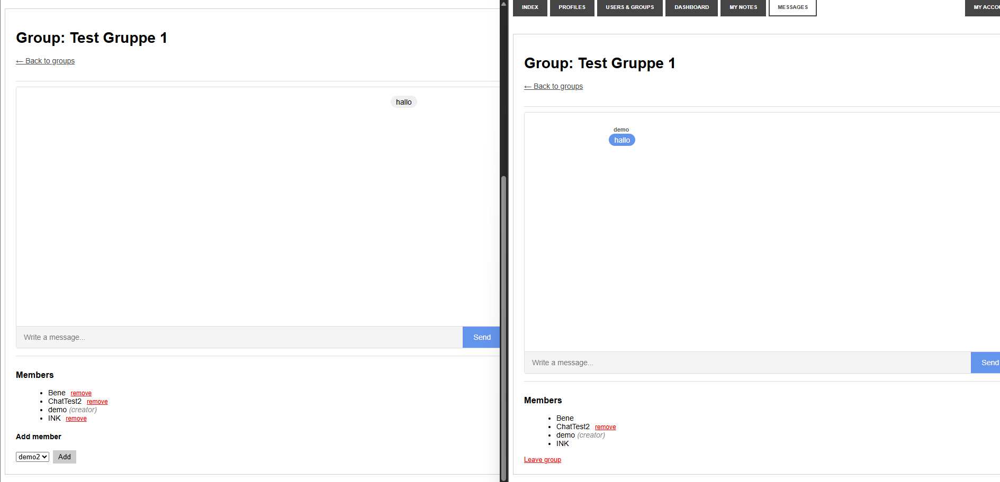

# HUGE Framework Aufgabe #004 (Gruppenchat)

### Prompt
You are a senior programmer.

Todays Task is this:

"Erweitere den Messenger um einen Gruppenchat:
•	ER-Diagramm für Gruppenchat erstellen (variable, selbst erstellbare Gruppen).
•	Nachrichtenversand an eine Gruppe und Anzeige im bestehenden Chat-Fenster.
•	Chats von Gruppenmitglieder per Namen kennzeichnen (nicht notwendig bei eigenen Nachrichten)."

Take your time for this task, before you start give me a plan for every change you are going to make.

# Fazit zur KI
Copilot seit 01.06 sehr teuer, nur die Erstellung vom Plan kostet 0,10€ was 1% vom monatlichen Nutzen sind. 
Die Umsetzung war nochmals 0,62€ also mehr als 6% vom monatlichen.
Dafür hat das ganze nicht mehr als 15 Minuten inkl. Testing gedauert.

# Vergleich
Mit einem KI Tool lässt es sich mit gutem Prompting viel schneller programmieren. 
Mittlerweile gibt es nicht mehr so viele Fehler, und wenn man sich vorher einen Plan erstellen lässt, lassen sich Fehler schon vor der Umsetzung gut erkennen.

# Bilder

#### Erstellter Plan
Plan
1. Database – 3 new tables (+ SQL install files)
Table	Columns	Purpose
groups	group_id PK, group_name, created_by FK→users, created_at	A user-created group
group_members	group_id FK, user_id FK (composite PK), joined_at	Who belongs to which group
group_messages	message_id PK, group_id FK, sender_id FK, message_text, created_at	Messages posted in a group
Files: 06-create-table-groups.sql, 07-create-table-group-members.sql, 08-create-table-group-messages.sql

2. Model – new GroupModel.php
Methods:

createGroup($name) — inserts group, adds creator as first member
addMember($group_id, $user_id) — adds a user to a group (only group creator can do this)
removeMember($group_id, $user_id)
getGroupsForUser() — all groups the current user belongs to, with last message & unread count
getGroupById($group_id) — fetch group meta
isMember($group_id, $user_id) — authorization check
sendGroupMessage($group_id, $text) — insert into group_messages
getGroupMessages($group_id) — all messages with sender name
markGroupRead($group_id) — mark messages as read (add is_read to group_messages or use a separate read-tracking table — I'll add is_read to keep it simple, same pattern as DM)
countUnreadGroup() — badge count for nav
3. Controller – new GroupController.php
Actions:

index() — list all groups the user is in
create() — show create-group form (GET) / handle form (POST)
conversation($group_id) — show group chat, mark as read
send($group_id) — handle message POST, redirect back
addMember($group_id) — add a user by name/id (POST, creator only)
removeMember($group_id, $user_id) — (creator only)
4. Views – new application/view/group/ folder
File	Purpose
index.php	List groups the user is in, link to conversation; button to create new group
create.php	Form: group name + select initial members from user list
conversation.php	Chat window reusing existing bubble CSS; sender name label on bubbles from others (not on own messages); form to send message; section to manage members (add/remove) shown to group creator
5. Modify existing files
File	Change
index.php	Add a "Groups" section below the DM table listing the user's groups with last message & unread badge
header.php	Extend the Messages nav badge to also count unread group messages
Summary of all file operations
Create (8 files):

_installation/06-create-table-groups.sql
_installation/07-create-table-group-members.sql
_installation/08-create-table-group-messages.sql
model/GroupModel.php
controller/GroupController.php
view/group/index.php
view/group/create.php
view/group/conversation.php
Modify (2 files):

view/message/index.php — add groups section
view/_templates/header.php — extend unread badge

